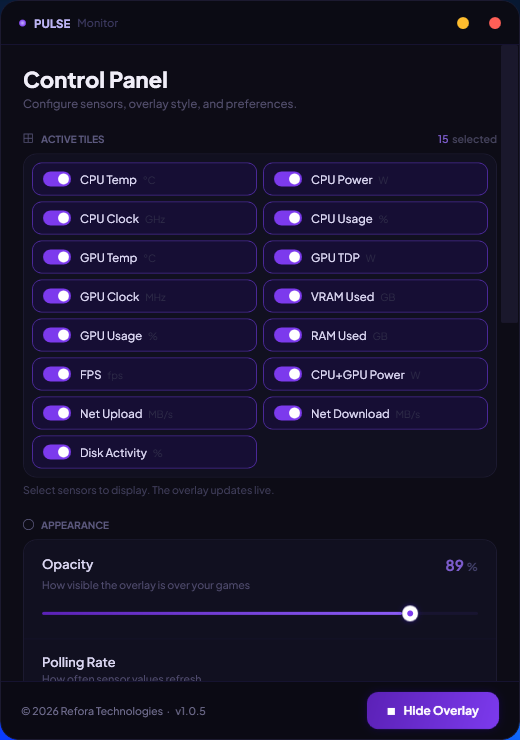
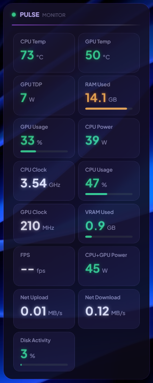
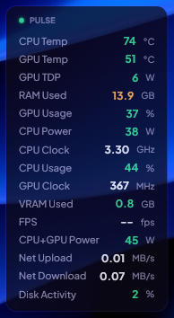

  
  <h1>Pulse Monitor</h1>
  
<b>A lightweight, precise, and beautiful hardware monitoring overlay for Windows.</b>

  

    
    
    
    
  

  

    <a href="https://pulse.reforatech.com">🌐 Website</a> &nbsp;·&nbsp;
    <a href="https://github.com/refora-technologies/pulse-monitor/releases/latest">⬇️ Download</a> &nbsp;·&nbsp;
    <a href="https://pulse.reforatech.com/privacy.html">🔒 Privacy</a>
  

 

## Overview

**Pulse** by Refora Technologies is a highly optimized hardware monitoring overlay designed to deliver real-time telemetry of your system's critical components. Built from the ground up for minimal performance impact, Pulse gives power users, gamers, and developers granular insight into CPU, GPU, Memory, and frame rate vitals—all through a premium, customizable user interface.

## Screenshots

  
  
  

## Key Features

- **Real-Time Telemetry:** Instant readouts for CPU/GPU Temperatures, Clock Speeds, Usage, Power Draw, VRAM/RAM utilization, FPS, Network throughput (upload/download), and Disk Activity.
- **FPS Monitoring:** Tracks the frame rate of whatever app or game currently has focus, powered by a bundled PresentMon capture — works with any GPU vendor. An optional **1% Low FPS** tile averages your slowest frames, showing stutter that an average frame rate hides.
- **GPU Selection:** On laptops and multi-GPU systems, choose exactly which adapter the GPU tiles read from, or leave it on automatic.
- **Dynamic Overlay:** A seamless glassmorphic HUD that sits unobtrusively on your screen, featuring a secondary "Compact Mode" designed specifically for distraction-free in-game monitoring. Right-click the overlay in free-drag mode for quick access to the control panel.
- **Ultra-Fast Polling:** Customizable interval polling directly integrated with LibreHardwareMonitor, down to 0.5 seconds for instantaneous tracking.
- **Arrange It Your Way:** Drag tiles into any order you like, or move them with the keyboard, and place the overlay by dragging it, snapping it to a corner, or sliding it into position.
- **Resilient Sensor Reading:** Sensors are read in an isolated background process, so a graphics driver fault cannot take Pulse down with it. Pulse also notices when a GPU is switched off or comes back, and re-detects your hardware on its own.
- **Verified Updates:** The in-app updater checks a SHA-256 checksum before installing anything and refuses to run an update that doesn't match, and downloads to a location only administrators can write to.
- **Diagnostics:** One click writes a log of recent errors to your desktop, so a problem can be reported with something concrete attached.
- **Refora Design Language:** A customized, violet-accented dark theme powered by the Plus Jakarta Sans font family for crisp, elegant readability.
- **Zero Configuration Setup:** Single-file executable architecture that runs seamlessly without requiring any external .NET runtime installations.

## Technical Stack

- **Framework:** .NET 8.0 (WPF)
- **Architecture:** MVVM Design Pattern (CommunityToolkit.Mvvm)
- **Hardware Integration:** LibreHardwareMonitor
- **Frame Rate Capture:** PresentMon
- **Data Serialization:** Newtonsoft.Json

## Installation

Download the latest installer from our official distribution channels. Pulse features a completely self-contained deployment model—no prerequisites required.

1. Run `PulseSetup.exe`.
2. Follow the on-screen instructions.
3. Pulse will automatically launch and minimize to the system tray.

> **Note on Administrator Privileges:** Pulse requires elevated administrator privileges upon launch in order to securely read low-level hardware sensors directly from the kernel interface.

## Configuration & Usage

Once launched, right-click the Pulse icon in the Windows system tray and select **Settings**. From the control panel, you can:
- Toggle the visibility of specific hardware tiles (e.g., *CPU Temp*, *GPU Power*, *FPS*).
- Reorder tiles by dragging the handle on each one, or with **Alt + arrow keys**. The overlay follows the order you set here.
- Choose which GPU the GPU tiles read from on multi-GPU systems.
- Show RAM and VRAM as used / total instead of just used.
- Define overlay opacity and screen position, including which display to use on multi-monitor setups.
- Fade the overlay's background independently of its text, down to just the readings floating on screen, and reset both to the default look in one click.
- Place the overlay precisely with the **X and Y** sliders, or drag it where you want it.
- Enable **Compact Mode** for a minimized, text-only HUD.
- Adjust the hardware polling rate (0.5s, 1s, 2s, 5s).
- Un-dock the overlay to manually drag it to any custom position on your desktop — right-click it in this mode for quick access to the control panel or to hide the overlay.
- Save a diagnostics file from the **About** section if you need to report a problem.

## License

This project is licensed under the **GNU General Public License v3.0 (GPLv3)**.

You are free to use, modify, and distribute this software, provided that any derivative works are also open-source and licensed under the identical terms. See the `LICENSE` file for the complete terms and conditions.

Pulse bundles and links to the following open-source components: LibreHardwareMonitor (MPL-2.0), PawnIO kernel driver (LGPL-2.1), PresentMon (MIT), Newtonsoft.Json (MIT), and CommunityToolkit.Mvvm (MIT). See `THIRD-PARTY-NOTICES.txt` for full attribution.

---

  
Crafted by <b>Refora Technologies</b>

  
<a href="https://reforatech.com">reforatech.com</a>

